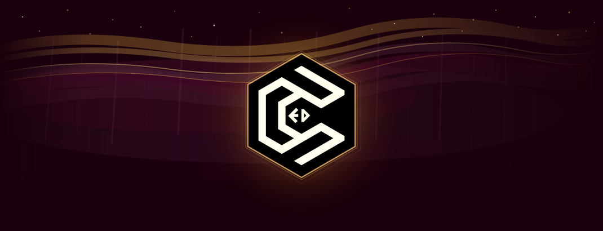

<h1>

</h1>

  

<svg xmlns="http://www.w3.org/2000/svg" viewBox="0 0 700 12" width="700" height="12">
 <defs>
 <linearGradient id="dg1" x1="0" y1="0" x2="1" y2="0">
 <stop offset="0%" stop-color="#d9a543" stop-opacity="0"/>
 <stop offset="20%" stop-color="#d9a543" stop-opacity="0.7"/>
 <stop offset="50%" stop-color="#ffd884" stop-opacity="1"/>
 <stop offset="80%" stop-color="#d9a543" stop-opacity="0.7"/>
 <stop offset="100%" stop-color="#d9a543" stop-opacity="0"/>
 </linearGradient>
 </defs>
 <rect x="0" y="5" width="700" height="1.5" fill="url(#dg1)"/>
 <circle cx="350" cy="6" r="4" fill="#ffd884">
 <animate attributeName="r" values="4;5.5;4" dur="2.5s" repeatCount="indefinite"/>
 <animate attributeName="opacity" values="1;0.4;1" dur="2.5s" repeatCount="indefinite"/>
 </circle>
 <circle cx="320" cy="6" r="2.2" fill="#d9a543" opacity="0.55">
 <animate attributeName="opacity" values="0.55;0.12;0.55" dur="2.5s" begin="0.35s" repeatCount="indefinite"/>
 </circle>
 <circle cx="380" cy="6" r="2.2" fill="#d9a543" opacity="0.55">
 <animate attributeName="opacity" values="0.55;0.12;0.55" dur="2.5s" begin="0.35s" repeatCount="indefinite"/>
 </circle>
 <circle cx="296" cy="6" r="1.3" fill="#d9a543" opacity="0.3">
 <animate attributeName="opacity" values="0.3;0.06;0.3" dur="2.5s" begin="0.6s" repeatCount="indefinite"/>
 </circle>
 <circle cx="404" cy="6" r="1.3" fill="#d9a543" opacity="0.3">
 <animate attributeName="opacity" values="0.3;0.06;0.3" dur="2.5s" begin="0.6s" repeatCount="indefinite"/>
 </circle>
</svg>
 

&nbsp;
&nbsp;
&nbsp;
&nbsp;

  

<table>
<tr>
<td align="center" width="46%">

 

 

 

</td>
<td align="left" width="54%">

</td>
</tr>
</table>

<svg xmlns="http://www.w3.org/2000/svg" viewBox="0 0 700 12" width="700" height="12">
 <defs><linearGradient id="dg2" x1="0" y1="0" x2="1" y2="0">
 <stop offset="0%" stop-color="#d9a543" stop-opacity="0"/><stop offset="20%" stop-color="#d9a543" stop-opacity="0.7"/><stop offset="50%" stop-color="#ffd884" stop-opacity="1"/><stop offset="80%" stop-color="#d9a543" stop-opacity="0.7"/><stop offset="100%" stop-color="#d9a543" stop-opacity="0"/>
 </linearGradient></defs>
 <rect x="0" y="5" width="700" height="1.5" fill="url(#dg2)"/>
 <circle cx="350" cy="6" r="4" fill="#ffd884"><animate attributeName="r" values="4;5.5;4" dur="2.5s" repeatCount="indefinite"/><animate attributeName="opacity" values="1;0.4;1" dur="2.5s" repeatCount="indefinite"/></circle>
</svg>

#### `>` Programming & Data

#### `>` Web & Software

#### `>` Tools & AI

#### `>` Databases

#### `>` Systems & Networking

#### `>` Creative & Docs

<svg xmlns="http://www.w3.org/2000/svg" viewBox="0 0 700 12" width="700" height="12">
 <defs><linearGradient id="dg3" x1="0" y1="0" x2="1" y2="0">
 <stop offset="0%" stop-color="#d9a543" stop-opacity="0"/><stop offset="20%" stop-color="#d9a543" stop-opacity="0.7"/><stop offset="50%" stop-color="#ffd884" stop-opacity="1"/><stop offset="80%" stop-color="#d9a543" stop-opacity="0.7"/><stop offset="100%" stop-color="#d9a543" stop-opacity="0"/>
 </linearGradient></defs>
 <rect x="0" y="5" width="700" height="1.5" fill="url(#dg3)"/>
 <circle cx="350" cy="6" r="4" fill="#ffd884"><animate attributeName="r" values="4;5.5;4" dur="2.5s" repeatCount="indefinite"/><animate attributeName="opacity" values="1;0.4;1" dur="2.5s" repeatCount="indefinite"/></circle>
</svg>

<svg xmlns="http://www.w3.org/2000/svg" viewBox="0 0 700 12" width="700" height="12">
 <defs><linearGradient id="dg4" x1="0" y1="0" x2="1" y2="0">
 <stop offset="0%" stop-color="#d9a543" stop-opacity="0"/><stop offset="20%" stop-color="#d9a543" stop-opacity="0.7"/><stop offset="50%" stop-color="#ffd884" stop-opacity="1"/><stop offset="80%" stop-color="#d9a543" stop-opacity="0.7"/><stop offset="100%" stop-color="#d9a543" stop-opacity="0"/>
 </linearGradient></defs>
 <rect x="0" y="5" width="700" height="1.5" fill="url(#dg4)"/>
 <circle cx="350" cy="6" r="4" fill="#ffd884"><animate attributeName="r" values="4;5.5;4" dur="2.5s" repeatCount="indefinite"/><animate attributeName="opacity" values="1;0.4;1" dur="2.5s" repeatCount="indefinite"/></circle>
</svg>

<picture>
 <source media="(prefers-color-scheme: dark)" srcset="https://raw.githubusercontent.com/Calfredo23/Calfredo23/output/snake-dark.svg"/>
 <source media="(prefers-color-scheme: light)" srcset="https://raw.githubusercontent.com/Calfredo23/Calfredo23/output/snake.svg"/>
 
</picture>

<svg xmlns="http://www.w3.org/2000/svg" viewBox="0 0 700 12" width="700" height="12">
 <defs><linearGradient id="dg6" x1="0" y1="0" x2="1" y2="0">
 <stop offset="0%" stop-color="#d9a543" stop-opacity="0"/><stop offset="20%" stop-color="#d9a543" stop-opacity="0.7"/><stop offset="50%" stop-color="#ffd884" stop-opacity="1"/><stop offset="80%" stop-color="#d9a543" stop-opacity="0.7"/><stop offset="100%" stop-color="#d9a543" stop-opacity="0"/>
 </linearGradient></defs>
 <rect x="0" y="5" width="700" height="1.5" fill="url(#dg6)"/>
 <circle cx="350" cy="6" r="4" fill="#ffd884"><animate attributeName="r" values="4;5.5;4" dur="2.5s" repeatCount="indefinite"/><animate attributeName="opacity" values="1;0.4;1" dur="2.5s" repeatCount="indefinite"/></circle>
</svg>

 

